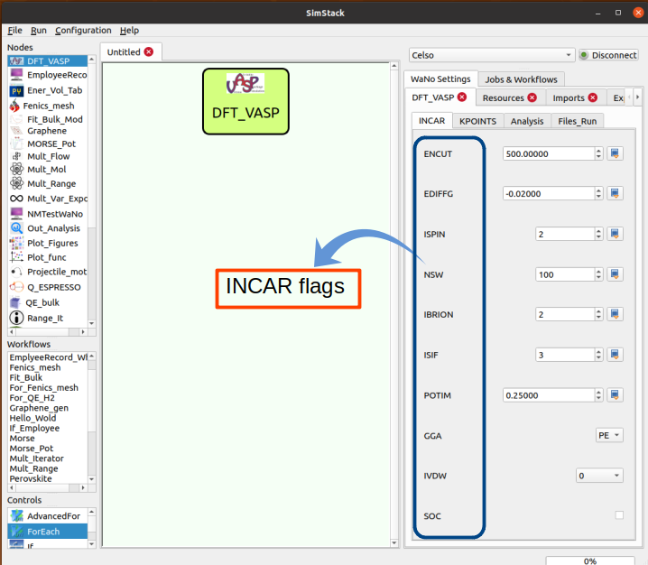

# DFT_VASP

## Vasp Bulk

-- This WaNo perform a single DFT calculation using Vasp code in order to generate 
an energy and volume values for a given Unit cell.

.caption[ **Fig. 1:** Image caption ]

** Fig 1** The DFT_VASP WaNo performs DFT calculation using Vasp code. In this WaNo, the POTCAR might be automatized after reading the POSCAR file. In the GUI, we can set the KPOINTS and INCAR files, but there is also the option to load the inputs file in the Files_Run tab.

## Inputs parameters
1. Unit Cell Types 
    - Simple cubic (SC)
    - Body Centered Cubic (BCC)
    - Face Centered Cubic (FCC)
    - Diamont Cubic (DC)
    * Default: SC

2.  ENCUT (eV)
    - A real value given in eV, which specifies the cutoff energy 
    for the planewave basis.
    * Default: 500.0

3.  Element
     - The chemical specie to be used
     * Default: Cu 
4. Lattice Constant ($`\overset{\circ}{\text{A}}`$)
    - The lattice constant to be calculated
    * Default: 3.6

## Inputs files
1. POSCAR
2. KPOINTS
3. INCAR
4. In this WaNo the POTCAR is generated automatically after the specification 
of the chemical species, this is valid only inside the int-nano cluster.

## Output files
1. OUTCAR    
    -The final converged calculation must return an OUTCAR file where the total energy, and volume
values can be found.

## Example: Vasp_Bulk

- Step 1. Copy all the files of this Git to your simstack_linux/simstack/WaNo folder. 
- Step 2. Open Simstack on your compute and connect to your remote resource.
- Step 3. Drag the Vasp_Bulk WaNo from the top left menu to the empty area as the figure below shows.
- Step 4. A double click on the WaNo will allow you to make the setups in the Input parameters.
- Step 5. Name your WaNo with Ctrl+S, and running it with Ctrl+R command.
